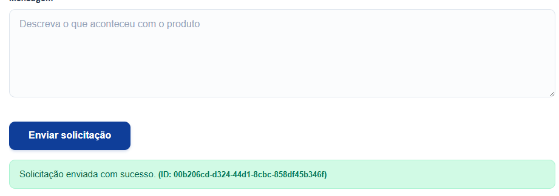
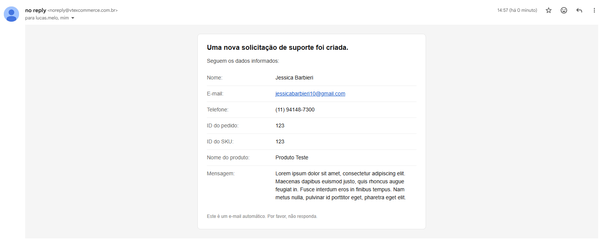

# Garantia Desafio – App VTEX IO

App de página institucional (Garantia e Suporte) com formulário de reporte de produto, carrossel editável e banner. Integração com **Master Data V1** (entidade PR) via **App Service (Node)** e envio de e-mail via **trigger** na criação do documento.

---

## Instalação e `vtex link`

1. **Pré-requisitos**: [VTEX IO – Basic setup](https://developers.vtex.com/docs/guides/vtex-io-documentation-1-basicsetup) (Toolbelt e workspace de desenvolvimento).

2. **Clone o repositório** e entre na pasta do app:
   ```bash
   cd desafio-frn
   ```

3. **Ajuste o `manifest.json`** (se necessário): `vendor` deve ser o nome da sua conta VTEX.

4. **Instale dependências da conta** (se ainda não tiver):
   ```bash
   vtex install vtex.store-sitemap vtex.store -f
   ```

5. **Link do app**:
   ```bash
   vtex link
   ```

6. **Abrir a loja no navegador**:
   ```bash
   vtex browse
   ```

7. **Acessar a página institucional**:  
   `https://{workspace}--{account}.myvtex.com/institucional/garantia`

---

## Estratégia adotada para imagem (e limitações)

- **Formulário (campo “Imagem”)**: o arquivo é convertido em **Base64** no front (via `FileReader.readAsDataURL`) e enviado no payload JSON para o Master Data V1 no campo `image`.  
  - **Limitações**: tamanho do documento (recomendado até 5 MB no form); Base64 aumenta ~33% o tamanho; campo no MD V1 deve aceitar string longa. Para muitos ou arquivos grandes, o ideal seria upload para blob storage (ex.: VTEX Assets) e enviar só a URL (bônus node).

---

## Decisões técnicas (validações, acessibilidade, UX)

- **Validações**: campos obrigatórios; e-mail com regex; tipo de arquivo (JPG/PNG) e tamanho máximo (ex.: 5 MB) configuráveis por prop; feedback por campo com `aria-invalid`, `data-invalid` e mensagens de erro.
- **Acessibilidade**: labels associados aos inputs, `aria-required`, `aria-describedby` para erros, `role="alert"` nas mensagens, `aria-labelledby` na seção do form, `alt` nas imagens do carrossel e do banner.
- **UX**: máscara de telefone (BR), placeholders, estados de loading/sucesso/erro, exibição do ID do documento criado no sucesso; estilos via **CSS Modules** (`ContactProductForm.css`).
- **Documento no MD V1**: o formulário envia os dados para o **App Service (Node)** em `POST /_v/garantia-desafio/product-report`. O backend valida, persiste na entidade **PR** do Master Data V1 e retorna **201** com o **id** do documento. Os campos com informação de usuário (`clientName`, `email`, `phone`) devem ser configurados como **privados** na entidade PR no admin do Master Data, para que apenas o app (com policy `ADMIN_DS`) possa gravá-los. Trigger MD V1 na entidade continua disparando o e-mail ao criar documento.

---

## App Service (Node) – Bônus

- **Rota**: `POST /_v/garantia-desafio/product-report` (pública).
- **Body**: JSON com `clientName`, `email`, `phone`, `orderId`, `invoiceNumber`, `skuId`, `ean`, `productName`, `message`, `image` (base64). Obrigatórios: `clientName`, `email`, `message`.
- **Resposta**: `201` com `{ "id": "<documentId>" }` ou `400`/`500` com `{ "error": "..." }`.
- **Master Data**: na entidade **PR** do Master Data V1, configure os campos **clientName**, **email** e **phone** como **privados** (schema da entidade no admin), para que apenas o serviço Node (com policy `ADMIN_DS`) possa gravá-los.

---

## Screenshots / GIF

### Página institucional


### Site Editor – Carrossel editável


### Solicitação enviada (feedback no form)



### E-mail recebido (trigger MD V1)


